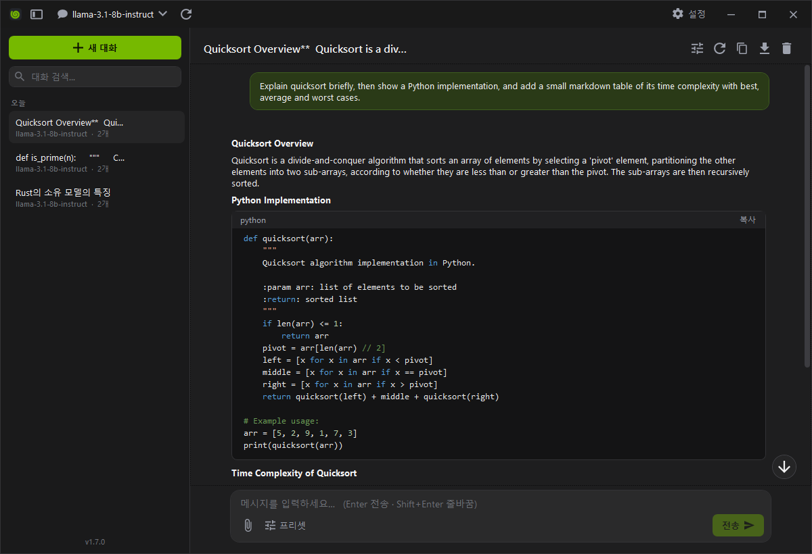
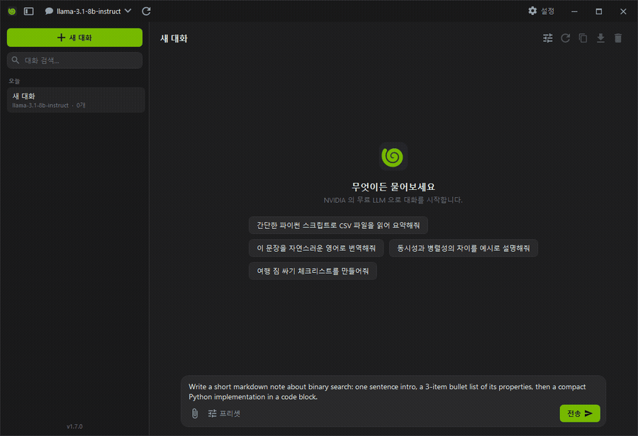

<div align="center">

# NvChat

**[build.nvidia.com](https://build.nvidia.com) 의 무료 LLM 들을 골라 채팅하는 Windows 데스크톱 앱**

스트리밍 채팅 · 대화 저장 · 실시간 마크다운/코드 렌더링 · 추론(reasoning) 표시 · 이미지 첨부 · 인앱 자동 업데이트 — 단일 `.exe` 하나로 실행

[English](README.md) · **한국어**

[](https://github.com/akon47/NvChat/actions/workflows/build.yml)
[](https://github.com/akon47/NvChat/releases/latest)
[](https://github.com/akon47/NvChat/releases)
[](https://github.com/akon47/NvChat/stargazers)
[](LICENSE)




<br>



<sub>답변이 스트리밍되는 도중에도 마크다운이 실시간으로 렌더링됩니다.</sub>

</div>

---

## ✨ 특징

- **모델 선택** — `/v1/models` 로 실제 사용 가능한 모델 목록을 불러와 상단에서 선택(실패 시 대표 모델로 폴백)
- **스트리밍 채팅** — 토큰 단위 실시간 표시, **중단** 버튼으로 즉시 취소
- **스트리밍 중 실시간 마크다운** — 답변이 오는 도중에도(클로드/챗GPT처럼) 서식이 바로 렌더링, 완료 후가 아님
- **추론(reasoning) 표시** — `reasoning_content` / `<think>` 지원 모델(deepseek-r1 등)의 사고 과정을 접이식으로 표시
- **이미지 첨부(비전 모델)** — 이미지를 첨부해 비전 모델(llama-3.2-vision 등)에 질문 (자동 축소 후 전송)
- **인앱 자동 업데이트** — GitHub Releases 를 확인해 새 `.exe` 를 내려받고 SHA-256 검증 후 자기 자신을 교체(단일 파일 방식, 설치 관리자 불필요)
- **대화별 사용량** — 요청 수와 입력/출력 토큰을 **모델별로** 집계. 대화 도중 모델을 바꿔도 모델마다 얼마나 썼는지 확인 가능
- **데스크톱 런처** — 전역 단축키(기본 `Ctrl+Shift+Space`)로 어디서든 뜨는 **빠른 채팅 미니창** + **시스템 트레이**(닫으면 트레이로 최소화)
- **개인화** — 모든 대화에 자동 적용되는 **커스텀 지침**(나에 대해 / 응답 방식) + 재사용 **프롬프트 프리셋**
- **검색 가능한 모델 선택기** — 100개+ 모델을 타이핑으로 필터링해 선택
- **메시지 액션** — 응답 **다시 생성**, 사용자 메시지 **편집 후 재생성**, 개별 **삭제**, **복사**
- **선택 가능한 마크다운** — 제목/목록/중첩·체크리스트/인용/**표**/링크, **구문 강조된 코드블록**(복사 버튼). 답변 텍스트를 드래그로 선택 가능
- **대화 관리** — 사이드바 **검색**, **날짜별 그룹**(오늘/어제/…), **고정**, **이름 변경**, 자동 저장, 모델 기반 **제목 자동 생성**
- **대화별 설정** — 시스템 프롬프트, Temperature/Top P/Max Tokens/Penalty 조절
- **내보내기** — 대화 전체 복사 / Markdown 파일로 저장
- **편의** — 맨 아래로 스크롤 버튼, 창 크기/위치 기억, 사이드바 접기, 단축키
- **안전한 저장** — API 키는 Windows DPAPI 로 암호화, 원자적 파일 쓰기 + 손상 파일 자동 백업
- **다국어** — 영어 · 한국어 UI, 설정에서 전환 (첫 실행 시 Windows 언어로 자동 선택)
- **UI** — 커스텀 보더리스 다크 테마(NVIDIA 그린 액센트), 챗GPT/클로드식 레이아웃(말풍선은 내 메시지에만)

## 📦 다운로드

[**Releases**](https://github.com/akon47/NvChat/releases/latest) 에서 `NvChat.exe` **파일 하나**만 내려받아 실행하면 됩니다.
.NET 런타임이 없어도 실행되는 self-contained 단일 실행 파일입니다. (Windows x64)

> **첫 실행:** 코드 서명이 없어 Windows SmartScreen 이 "Windows의 PC 보호" 창을 띄울 수 있습니다. **추가 정보 → 실행**을 누르세요.

> 자동 업데이트가 포함된 버전부터는 새 버전이 앱 안에서 안내되므로 다시 수동으로 받을 필요가 없습니다.

## 🔑 API 키 발급

1. [build.nvidia.com](https://build.nvidia.com) 에 로그인
2. 아무 모델 페이지에서 **Get API Key** 로 `nvapi-...` 키 발급
3. 앱 첫 실행 시 뜨는 **설정** 창(또는 우상단 ⚙)에 키를 붙여넣고 **연결 테스트 → 저장**

> 키는 **이 PC + 이 Windows 계정에만** DPAPI 로 암호화되어 저장됩니다(`%APPDATA%\NvChat\settings.json`). 다른 PC/계정에서는 복호화되지 않습니다.

## ⌨️ 단축키

| 키 | 동작 |
|---|---|
| `Enter` | 전송 (설정에서 `Ctrl+Enter` 전송으로 변경 가능) |
| `Shift+Enter` | 줄바꿈 |
| `Ctrl+N` | 새 대화 |
| `Ctrl+Shift+Space` | 어디서든 빠른 채팅 (전역 · 설정에서 변경) |

## 🛠️ 소스에서 빌드

```powershell
# 개발 실행
dotnet run --project NvChat/NvChat.csproj

# 단일 exe 배포 빌드 (파일 하나 생성)
dotnet publish NvChat/NvChat.csproj -c Release
# → NvChat/bin/Release/net8.0-windows/win-x64/publish/NvChat.exe
```

요구 사항: .NET 8 SDK (Windows).

## 🚀 릴리스 (자동 배포)

`v*` 형식의 태그를 푸시하면 GitHub Actions([`release.yml`](.github/workflows/release.yml))가
단일 `NvChat.exe` 와 `NvChat.exe.sha256` 을 빌드해 해당 태그의 Release 에 자동 업로드합니다.
앱의 인앱 업데이터가 이 체크섬으로 다운로드를 검증합니다.

```bash
git tag v1.0.0
git push origin v1.0.0
```

## 🧩 기술

.NET 8 / WPF (`net8.0-windows`). MVVM 구조와 커스텀 `WindowView`(WindowChrome 보더리스 크롬),
다크 팔레트, 자체 마크다운 렌더러/구문 강조기를 외부 UI 라이브러리 없이 구현했습니다.

- 엔드포인트: `https://integrate.api.nvidia.com/v1` (OpenAI 호환, 설정에서 변경 가능)
- 데이터 저장: `%APPDATA%\NvChat\` (`settings.json`, `conversations.json`)
- 무료 티어에는 NVIDIA 측 요청 한도가 있어, 429 응답 시 잠시 후 재시도하세요.

## 📄 라이선스

[MIT](LICENSE) — 자유롭게 사용/수정/배포할 수 있습니다.
