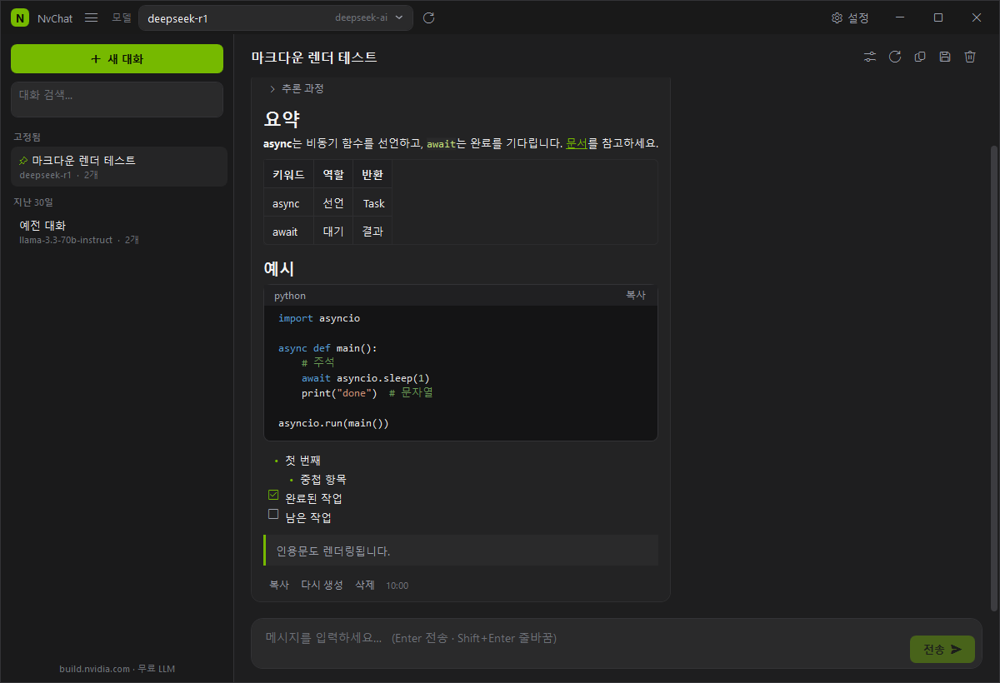

<div align="center">

# NvChat

**[build.nvidia.com](https://build.nvidia.com) 의 무료 LLM 들을 골라 채팅하는 Windows 데스크톱 앱**

스트리밍 채팅 · 대화 저장 · 마크다운/코드 렌더링 · 추론(reasoning) 표시 — 단일 `.exe` 하나로 실행

[](https://github.com/akon47/NvChat/actions/workflows/build.yml)
[](https://github.com/akon47/NvChat/releases/latest)
[](https://github.com/akon47/NvChat/releases)
[](https://github.com/akon47/NvChat/stargazers)
[](LICENSE)




</div>

---

## ✨ 특징

- **모델 선택** — `/v1/models` 로 실제 사용 가능한 모델 목록을 불러와 상단에서 선택(실패 시 대표 모델로 폴백)
- **스트리밍 채팅** — 토큰 단위 실시간 표시, **중단** 버튼으로 즉시 취소
- **추론(reasoning) 표시** — `reasoning_content` / `<think>` 지원 모델(deepseek-r1 등)의 사고 과정을 접이식으로 표시
- **메시지 액션** — 응답 **다시 생성**, 사용자 메시지 **편집 후 재생성**, 개별 **삭제**, **복사**
- **마크다운 렌더링** — 제목/목록/중첩·체크리스트/인용/**표**/링크, **구문 강조된 코드블록**(복사 버튼)
- **대화 관리** — 사이드바 **검색**, **날짜별 그룹**(오늘/어제/…), **고정**, **이름 변경**, 자동 저장, 모델 기반 **제목 자동 생성**
- **대화별 설정** — 시스템 프롬프트, Temperature/Top P/Max Tokens/Penalty 조절
- **내보내기** — 대화 전체 복사 / Markdown 파일로 저장
- **편의** — 맨 아래로 스크롤 버튼, 창 크기/위치 기억, 사이드바 접기, 단축키
- **안전한 저장** — API 키는 Windows DPAPI 로 암호화, 원자적 파일 쓰기 + 손상 파일 자동 백업
- **UI** — 커스텀 보더리스 다크 테마(NVIDIA 그린 액센트)

## 📦 다운로드

[**Releases**](https://github.com/akon47/NvChat/releases/latest) 에서 `NvChat.exe` **파일 하나**만 내려받아 실행하면 됩니다.
.NET 런타임이 없어도 실행되는 self-contained 단일 실행 파일입니다. (Windows x64)

## 🔑 API 키 발급

1. [build.nvidia.com](https://build.nvidia.com) 에 로그인
2. 아무 모델 페이지에서 **Get API Key** 로 `nvapi-...` 키 발급
3. 앱 첫 실행 시 뜨는 **설정** 창(또는 우상단 ⚙)에 키를 붙여넣고 **연결 테스트 → 저장**

> 키는 **이 PC + 이 Windows 계정에만** DPAPI 로 암호화되어 저장됩니다(`%APPDATA%\NvChat\settings.json`). 다른 PC/계정에서는 복호화되지 않습니다.

## ⌨️ 단축키

| 키 | 동작 |
|---|---|
| `Enter` | 전송 (설정에서 `Ctrl+Enter` 전송으로 변경 가능) |
| `Shift+Enter` | 줄바꿈 |
| `Ctrl+N` | 새 대화 |

## 🛠️ 소스에서 빌드

```powershell
# 개발 실행
dotnet run --project NvChat/NvChat.csproj

# 단일 exe 배포 빌드 (파일 하나 생성)
dotnet publish NvChat/NvChat.csproj -c Release
# → NvChat/bin/Release/net8.0-windows/win-x64/publish/NvChat.exe
```

요구 사항: .NET 8 SDK (Windows).

## 🚀 릴리스 (자동 배포)

`v*` 형식의 태그를 푸시하면 GitHub Actions([`release.yml`](.github/workflows/release.yml))가
단일 `NvChat.exe` 를 빌드해 해당 태그의 Release 에 자동 업로드합니다.

```bash
git tag v1.0.0
git push origin v1.0.0
```

## 📁 프로젝트 구조

```
NvChat/
  ComponentModel/  ObservableObject
  Commands/        DelegateCommand, AsyncDelegateCommand
  ViewModels/      Main / Settings / Conversation / ChatMessage / Window
  Models/          AppSettings, Conversation, ChatMessage, NvModel, GenerationParameters
  Services/        NvidiaClient(스트리밍), Settings/ConversationStore, SecureText(DPAPI), AtomicFile
  Controls/        MarkdownRenderer, CodeHighlighter, MarkdownPresenter
  Converters/  Behaviors/  Views/(WindowView 커스텀 크롬)  Resources/(테마)
```

- 엔드포인트: `https://integrate.api.nvidia.com/v1` (OpenAI 호환, 설정에서 변경 가능)
- 데이터 저장: `%APPDATA%\NvChat\` (`settings.json`, `conversations.json`)
- 무료 티어에는 NVIDIA 측 요청 한도가 있어, 429 응답 시 잠시 후 재시도하세요.

## 🧩 기술

.NET 8 / WPF (`net8.0-windows`). MVVM 구조와 커스텀 `WindowView`(WindowChrome 보더리스 크롬),
다크 팔레트, 자체 마크다운 렌더러/구문 강조기를 외부 UI 라이브러리 없이 구현했습니다.
(개인 WPF 공통 라이브러리의 코드 컨벤션을 참고했으나 해당 DLL 은 참조하지 않습니다.)

## 📄 라이선스

[MIT](LICENSE) — 자유롭게 사용/수정/배포할 수 있습니다. (원하는 라이선스로 바꿔도 됩니다.)
